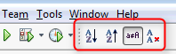

nb-sort-line-tools
==================

NetBeans plugin which adds a toolbar with texteditor operations for sorting 

Support following operations in text editors:

1. Sort lines spanned by selection in ascending/descending (in-)case-sensitive order
2. Remove duplicate lines while sorting.

You can also assign shortcuts to these actions.

Plugin is available via http://plugins.netbeans.org/plugin/45925

Further information:
This plugin is based on the _"Line Tools"_ plugin from _sandipchitale_ @ 
http://plugins.netbeans.org/plugin/3857/line-tools
It is mainly a repackaging to be compatible with NetBeans 7.x. 
All obsolete features except sorting are disabled. No bugs were fixed or features added. 
Original sourcecode can be found at http://hg.netbeans.org/main/contrib/file/tip/linetools

License remains CDDL - http://www.netbeans.org/cddl-gplv2.html

Compatible to NetBeans 7.0 and higher
